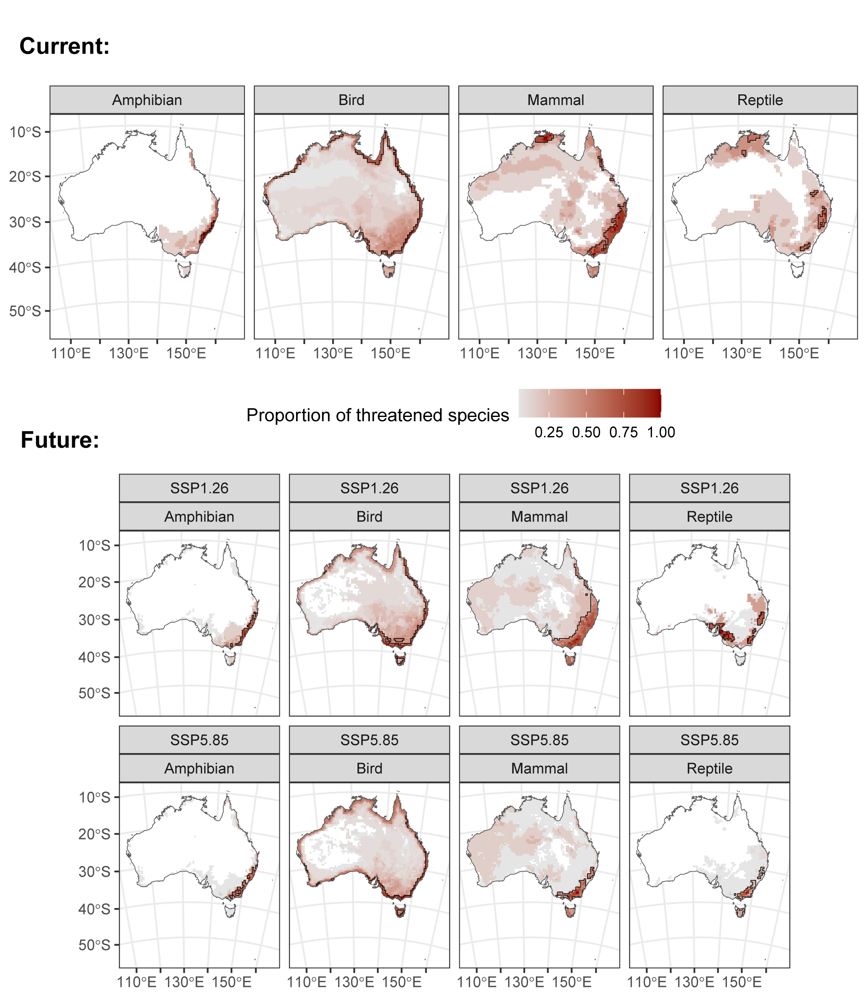

# Over-the-horizon extinction risk analyses for Australian tetrapods

This repository contains code required to run analyses of future
extinction risk for Australia’s land vertebrates. The methodology
includes using public occurrence records to build species distribution
models and projecting possible future ranges under different scenarios
of climate change. Then, these are used together with changing metrics
of threatening processes to produce future IUCN threat assessments,
based on machine learning methods for automated assessment.

Finally, the outputs are used to explore

**1. how and why threat assessments of species change through time:**

**2. which species go extinct and where:**

**3. how threat hotspots change through time:**

The full methodology will be described in an upcoming paper, currently
undergoing revisions. The underlying data required to run these analyses
will be shared in a data repository upon publication, or are publicly
available from sources referenced in the paper. The annotated code can
be seen in <https://alexsla.github.io/extinction/>.
